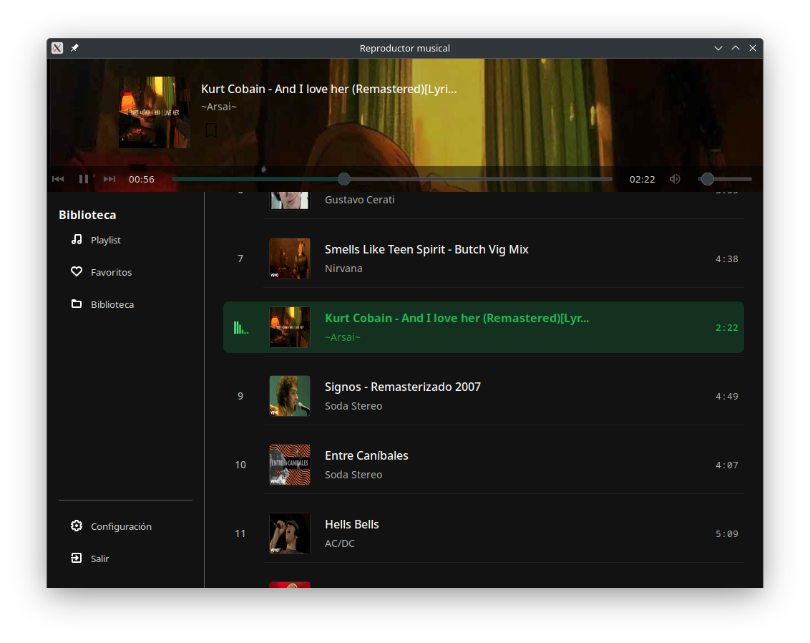
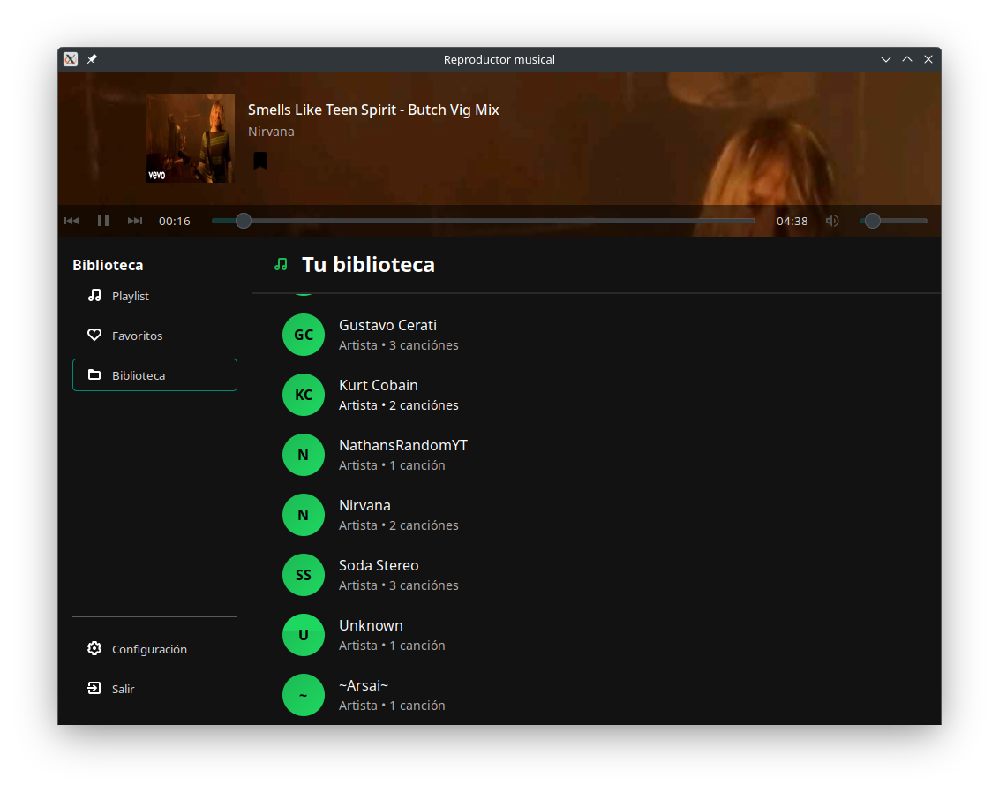

---

### Rust Music Player GUI 🎵

Un reproductor musical moderno desarrollado en **Rust**, utilizando **GTK 3** para la interfaz gráfica, **GStreamer** y **Symphonia** para la reproducción de audio, y **Lofty** para la lectura de metadatos (título, artista, portada, etc.).

---

### Características

* Reproduce archivos **MP3**, **FLAC**, **OGG**.
* Muestra portada del álbum (si está disponible).
* Escanea directorios completos con `walkdir`.
* Lee metadatos (título, artista, álbum, duración) usando `lofty`.
* Reproducción aleatoria con `fastrand`.
* Interfaz moderna con `GTK`, `GDK`, `Pango`, `Cairo`.
* Soporte para múltiples rutas usando `gio`.

---

### Dependencias principales

```toml
[dependencies]
gtk = "0.15"
gdk = "0.15"
gdk-pixbuf = "0.15"
gio = "0.15"
glib = "0.15"
cairo-rs = "0.15"
pango = "0.20.12"

symphonia = { version = "0.5.4", features = ["mp3", "flac", "vorbis"] }
gstreamer = "0.23.7"
lofty = "0.22.4"

walkdir = "2"
rand = "0.8"
fastrand = "2.3.0"

serde = { version = "1.0.219", features = ["derive"] }
serde_json = "1.0.140"
once_cell = "1.21.3"
image = "0.24"
```

---

### 🛠️ Compilación

#### 📦 Requisitos previos

Asegúrate de tener instalado:

* Rust (nightly o stable)
* GTK 3 (`libgtk-3-dev` en Linux)
* GStreamer y sus plugins (`gstreamer1.0-plugins-base`, `good`, `bad`, `ugly`)

#### 🧪 Linux (Debian/Ubuntu):

```bash
sudo apt install libgtk-3-dev libgstreamer1.0-dev \
libgstreamer-plugins-base1.0-dev \
gstreamer1.0-plugins-good gstreamer1.0-plugins-ugly gstreamer1.0-libav
```

#### 🔧 Build del proyecto:

```bash
cargo build --release
```

#### ▶️ Ejecutar:

```bash
cargo run
```

---

### 📂 Estructura del Proyecto (ejemplo)

```
src/
├── main.rs
├── kernel.rs          # Control de reproducción
├── loader.rs        # Lectura de metadatos con Lofty
├── gui.rs             # Interfaz gráfica con GTK
├── utils.rs           # Utilidades como aleatoriedad, rutas, etc.
```

---

### 📸 Capturas de Pantalla



---

### 📄 Licencia

Este proyecto está licenciado bajo la licencia MIT. Consulta el archivo `LICENSE` para más detalles.

---
